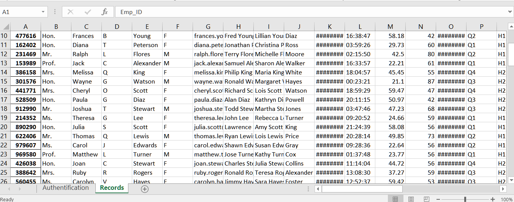

# EmployeeData
## Project description
Manipulating data from an excel spreadshhet **(100 Records.xlsx)** which is provided.(NOTE that the dataset including the emails, the phone numbers, the Social Security numbers is fake and was generated by the VBA system)
### Step 1 - Clean the data
Import the data using **pandas** and create a dataframe in which you will:
- Check for missing values.
- Check for duplicates.
- Remove spaces in column names.
- Set the index.
- Separate into relevant data frames.
### Step 2 - Export the data to a Mysql Database.
Libraries needed are:
- pymysql
- mysql connnector
- sqlalchemy
- Create and connect to a database with two tables as illustrated below:
 
 
 ### Step 3 - Export the data to another Excel file.
 - Create an Excel file **(workers.xlsx)** with two worksheets as illustrated below:
 
 

